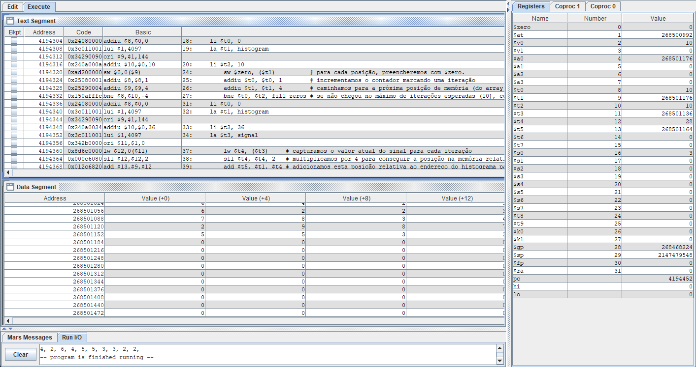

# Cálculo do histograma de um vetor - Assembly MIPS 

O vetor `V` a seguir representa uma captura de `36` amostras de um sinal com `10` níveis de intensidade diferentes (indo de `0 até 9`).

```asm
  V = [9, 5, 7, 5, 3, 4, 0, 2, 6, 4, 2, 5, 4, 1, 2, 1, 6, 2, 2, 3, 6, 3, 0, 0, 7, 8, 3, 4, 5, 4, 0, 5, 2, 9, 8, 7]
```

Normalmente, em tarefas de processamento de sinais, sejam eles unidimensionais ou bidimensionais (como imagens digitais, por exemplo) uma ação comumente realizada é obter o histograma do sinal disponível.

O cálculo do histograma é a contagem do número de amostras existentes para cada intensidade que se apresenta nas amostras disponibilizadas. Ela se mostra por meio de um array H, em que cada elemento seu armazena a contagem de amostras que tem a intensidade igual ao valor que aparece em seu índice. Por exemplo, o elemento `H(0)` armazena a contagem de elementos de `V` que têm valor igual a `0`; `H(1)` armazena o total de elementos que têm valor `1` em `V`; e, assim, sucessivamente.

O histograma pode ser facilmente determinado através do seguinte algoritmo;

```
  Declarar Lmax como o número máximo de intensidades do vetor analisado
  Declarar TAM como o tamanho do vetor analisado
  
  Para i = 0 até Lmax, fazer
    H[i] = 0;
  Para i = 0 até TAM, fazer
    H[V[i]] = H[V[i]] + 1;
```

O objetivo aqui é elaborar um programa em `assembly` para arquitetura `MIPS` que calcule o histograma do vetor `V` apresentado anteriormente e que armazene em um vetor `H`, previamente alocado na memória. O programa foi testado no simulador [MARS](http://courses.missouristate.edu/kenvollmar/mars/).



---

<div align="center">
  Universidade Federal do Rio Grande do Norte - UFRN <br/>
  Departamento de Engenharia de Computação e Automação - Centro de Tecnologia  <br/>
  DCA0104 – Arquitetura de Computadores - Professor: Diogo Pinheiro Fernandes Pedrosa
</div>